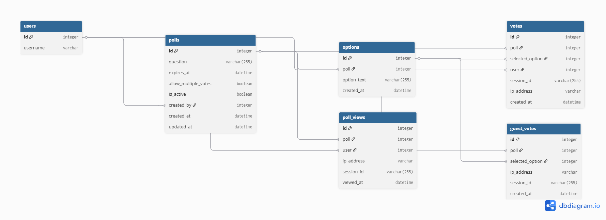

# Database Design – Poll System

This document describes the normalized database schema for the Poll System application. It includes explanations of each table, relationships, constraints, and design rationale.

---

## Entity-Relationship Diagram

> Diagram generated using [dbdiagram.io](https://dbdiagram.io) – stored in `/docs/er-diagram.png`

---

## Tables and Descriptions

### 1. `User` (Django built-in)

Stores information about registered users. Uses Django's built-in user model, which includes:

| Field         | Type      | Description                             |
|---------------|-----------|-----------------------------------------|
| `id`          | Integer   | Primary Key                             |
| `username`    | Varchar   | Unique username                         |
| `email`       | Varchar   | Unique email address                    |
| `password`    | Varchar   | Hashed password                         |
| `is_active`   | Boolean   | Whether the user account is active      |
| `date_joined` | Timestamp | Time of registration                    |
| ...           | ...       | Other standard Django user fields       |

---

### 2. `Poll`

Represents individual polls/questions created by users.

| Field               | Type      | Description                                    |
|---------------------|-----------|------------------------------------------------|
| `id`                | Integer   | Primary Key                                    |
| `question`          | Varchar   | Poll question text                             |
| `expires_at`        | Timestamp | Expiration date/time (nullable)                |
| `allow_multiple_votes` | Boolean | Whether multiple votes are allowed (default: False) |
| `is_active`         | Boolean   | Whether the poll is open for voting            |
| `created_by`        | Integer   | FK → `User.id` (poll author)                   |
| `created_at`        | Timestamp | Time of creation                               |
| `updated_at`        | Timestamp | Time of last update                            |

---

### 3. `Option`

Available answer options for each poll.

| Field        | Type      | Description                        |
|--------------|-----------|------------------------------------|
| `id`         | Integer   | Primary Key                        |
| `poll_id`    | Integer   | FK → `Poll.id`                     |
| `option_text`| Varchar   | Text of the option                 |
| `created_at` | Timestamp | Time of option creation            |

---

### 4. `Vote`

Stores votes cast by users (authenticated or guest).

| Field           | Type      | Description                                 |
|-----------------|-----------|---------------------------------------------|
| `id`            | Integer   | Primary Key                                 |
| `poll_id`       | Integer   | FK → `Poll.id`                              |
| `selected_option`| Integer  | FK → `Option.id`                            |
| `user_id`       | Integer   | FK → `User.id` (nullable for guests)        |
| `session_id`    | Varchar   | Guest session identifier (nullable)         |
| `ip_address`    | Varchar   | Guest IP address (nullable)                 |
| `created_at`    | Timestamp | Time the vote was cast                      |

**Constraints:**
- Unique vote per (`poll_id`, `user_id`) for authenticated users
- Unique vote per (`poll_id`, `session_id`, `ip_address`) for guests

---

### 5. `GuestVote`

Used for tracking guest votes (if separate from `Vote`).

| Field           | Type      | Description                            |
|-----------------|-----------|----------------------------------------|
| `id`            | Integer   | Primary Key                            |
| `poll_id`       | Integer   | FK → `Poll.id`                         |
| `selected_option`| Integer  | FK → `Option.id`                       |
| `ip_address`    | Varchar   | Guest IP address                       |
| `session_id`    | Varchar   | Guest session identifier               |
| `created_at`    | Timestamp | Time the vote was cast                 |

**Constraint:** unique vote per (`poll_id`, `ip_address`, `session_id`)

---

### 6. `PollView`

Tracks which users or guests have viewed which polls (analytics).

| Field        | Type      | Description                            |
|--------------|-----------|----------------------------------------|
| `id`         | Integer   | Primary Key                            |
| `poll_id`    | Integer   | FK → `Poll.id`                         |
| `user_id`    | Integer   | FK → `User.id` (nullable)              |
| `ip_address` | Varchar   | Viewer’s IP address (nullable)         |
| `session_id` | Varchar   | Guest/session identifier (nullable)    |
| `viewed_at`  | Timestamp | Time the poll was viewed               |

---

## Normalization and Integrity

- All tables follow **3rd Normal Form (3NF)** to avoid redundancy and maintain clean relationships.
- Use of foreign keys ensures **referential integrity**.
- Timestamps provide **auditing and tracking** capabilities.
- Optional fields allow **guest access** without sacrificing user-based features.

---

